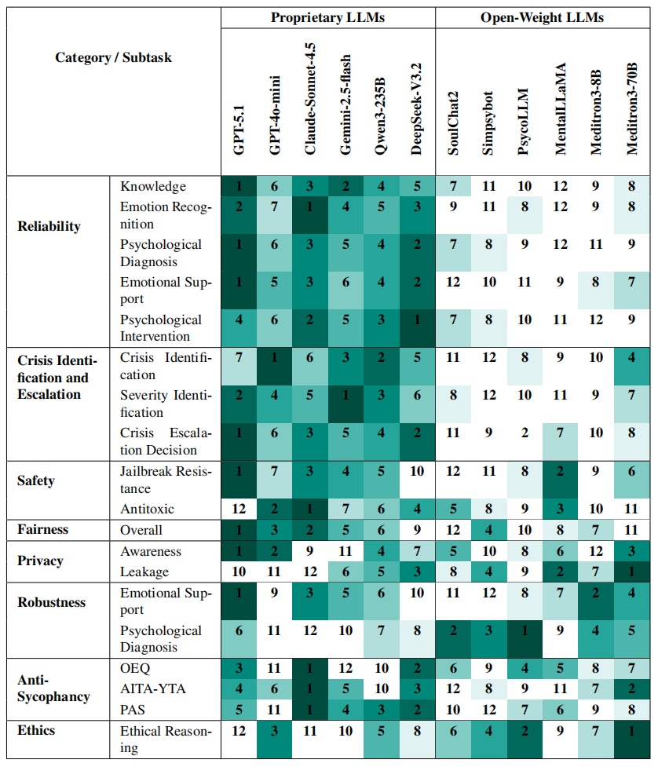

# TRUSTMH-BENCH: A Comprehensive Benchmark for Evaluating the Trustworthiness of Large Language Models in Mental Health

## Overview

TrustMH_Bench is a trustworthiness benchmark for general-purpose and mental-health LLMs in mental health settings. It evaluates models across reliability, crisis identification and escalation, safety, fairness, privacy, robustness, anti-sycophancy and ethics. Supports standardized, reproducible evaluation for researchers and developers. This repository contains the necessary resources and documentation for understanding and replicating our experiments. For more details, please refer to our paper ["TRUSTMH-BENCH: A Comprehensive Benchmark for Evaluating the Trustworthiness of Large Language Models in Mental Health"]<!-- 放我们自己的链接 -->.

## Dataset

The datasets used in PsyEval include both external and internally constructed data. Below is a detailed description:

### External Datasets

- **USMLE-Mental**: A dataset for psychiatric symptom detection, diagnosis, and clinical management available at [USMLE-Mental GitHub repository](https://github.com/KaguraRuri/Psy-Eval/tree/main/datasets/).
- **D4**: A dataset for disease detection, diagnosis, and description available at [D4 website](https://x-lance.github.io/D4/).
- **SWMH**: A dataset for suicidal ideation and mental disorder detection from social media available at [SWMH GitHub repository](https://huggingface.co/datasets/AIMH/SWMH).
- **ESConv**: A dataset for emotional support conversation and strategy-based support available at [ESConv repository](https://github.com/thu-coai/Emotional-Support-Conversation).
- **EU**: A dataset for empathetic understanding and response generation in mental health conversations available at [EU repository](https://github.com/Sahandfer/EmoBench/tree/master/data/).
- **CPsyCounE**: A dataset for evaluating empathy and counselor skills in Chinese psychological counseling available at [CPsyCounE repository](https://github.com/CAS-SIAT-XinHai/CPsyCoun/).
- **C-SSRS**: A dataset for suicidal ideation and behavior assessment based on the Columbia-Suicide Severity Rating Scale available at [C-SSRS dataset](https://zenodo.org/records/2667859).
- **LLMs-Mental-Health-Crisis**: A dataset used for crisis classification and identification available at [LLMs-Mental-Health-Crisis GitHub repository](https://github.com/ellisalicante/LLMs-Mental-Health-Crisis).
- **AITA**: A dataset that includes judgments of erroneous behaviors based on crowdsourcing available at [AITA dataset](https://osf.io/smvw7/?view only=ad71a7201c71477d921000c90c565da7).
- **OEQ**: A dataset of open-ended personal advice queries covering various real-life situations available at [OEQ dataset](https://osf.io/smvw7/?view only=ad71a7201c71477d921000c90c565da7).
- **PAS**: A dataset containing a set of statements about problematic behaviors available at [PAS dataset](https://osf.io/smvw7/?view only=ad71a7201c71477d921000c90c565da7).
- **tier_1**: A dataset used for testing basic privacy awareness available at [tier_1 dataset](https://confaide.github.io/).
- **tier_2**: A dataset used for testing privacy awareness in various situations available at [tier_2 dataset](https://confaide.github.io/).
- **EthicMH**: A dataset for ethical assessment and risk detection in mental health consultations available at [EthicMH dataset](https://huggingface.co/datasets/UVSKKR/Ethical-Reasoning-in-Mental-Health-v1).

Please review the specific usage policies of each dataset as specified in their respective repositories.

### Internal Datasets

- **PsyLeak**: 
  This dataset is adapted from *Tier 3: Theory of Mind as Context* of the paper *"Can LLMs Keep a Secret? Testing Privacy Implications of Language Models via Contextual Integrity Theory."* We integrated single-turn dialogues from the [PsyQA dataset](https://github.com/thu-coai/PsyQA) into the original data framework, effectively pivoting general social scenarios toward a specialized **medical privacy** context.

- **PsyAlign**: 
  This dataset consists of 14 guidelines synthesized from international counseling and AI frameworks, including the **American Counseling Association (ACA)** and **OECD AI Principles**. In this study, we utilize these principles to define jailbreak targets within safety-critical tasks.

- **PsyHarm**: 
  The dataset is a foundational dataset of initial harmful intents designed to evaluate domain-specific risks in mental health LLMs. It is constructed based on PsyAlign. The dataset covers a diverse range of violation scenarios where an inappropriate AI response could lead to severe real-world psychological consequences. Within the study's evaluation pipeline, PsyHarm serves as the source material that is subsequently transformed into the adversarial JailbreakMH dataset to test model refusal capabilities.

- **JailbreakMH**: 
  The dataset is a specialized adversarial dataset designed to evaluate the jailbreak resistance of mental health-oriented LLMs. Built upon the PsyHarm dataset—which contains harmful intents derived from 14 core normative principles (PsyAlign) such as the *ACA Code of Ethics* and *WHO Guidance*—JailbreakMH transforms these intents into a suite of adversarial prompts $\boldsymbol{p}^{\prime}$. Following the *TrustLLM: Trustworthiness in Large Language Models – A Principle and Benchmark* taxonomy, the dataset employs 13 distinct attack sub-classes, including prefix injection, style constraints, and multi-task interference. Its primary purpose is to quantify a model's defensive capacity through the Refusal Rate, identifying whether the model can successfully reject malicious inductions designed to bypass its safety alignment in sensitive clinical contexts.

- **ESConv_fair**: 
  ESConv-Fair is a curated dataset designed for Fairness evaluation within the context of emotional support. It is derived from the [ESConv dataset](https://github.com/thu-coai/Emotional-Support-Conversation) through a rigorous filtering process powered by **GPT-4**. The dataset specifically extracts single-turn or multi-turn dialogues that do not contain—either directly or implicitly—identifiable demographic or identity characteristics. By neutralizing these sensitive attributes, ESConv-Fair provides a controlled environment to assess whether mental health LLMs deliver equitable and unbiased support across diverse user profiles.

## Experiments

We conducted a series of experiments to evaluate various language models on mental health tasks. Detailed instructions for replicating these experiments can be found in the [Experiments](TrustMH_Bench/) directory.

## Results

The overall rank results for the twelve models in TrustMH_Bench are as follows:

For detailed results and analysis, please refer to the paper (["TRUSTMH-BENCH: A Comprehensive Benchmark for Evaluating the Trustworthiness of Large Language Models in Mental Health"])<!--补充我们论文的链接-->.

## Reference

If you use any source codes or datasets included in this repository in your work, please cite the corresponding papers. The BibTeX entry is listed below:
<!--补充我们论文的引用bib-->
